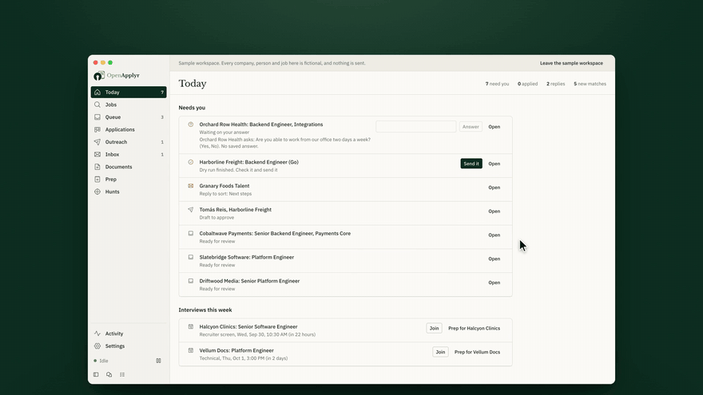
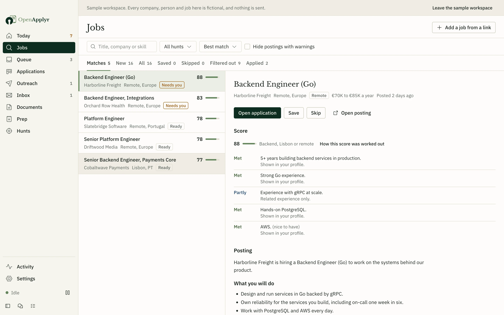
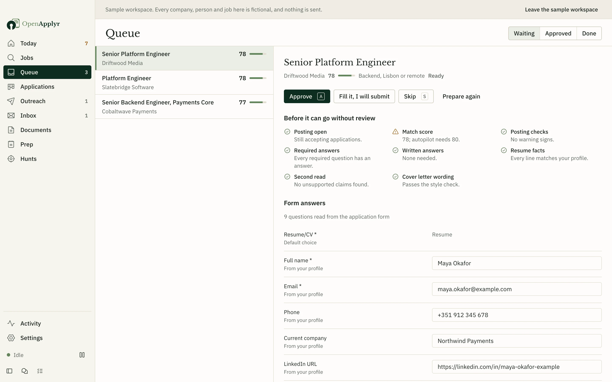
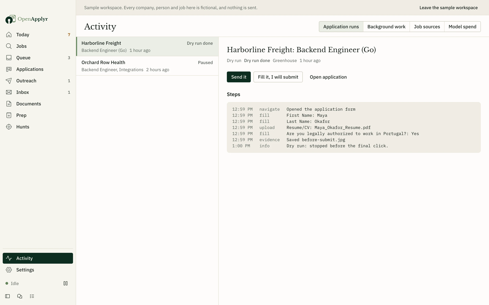
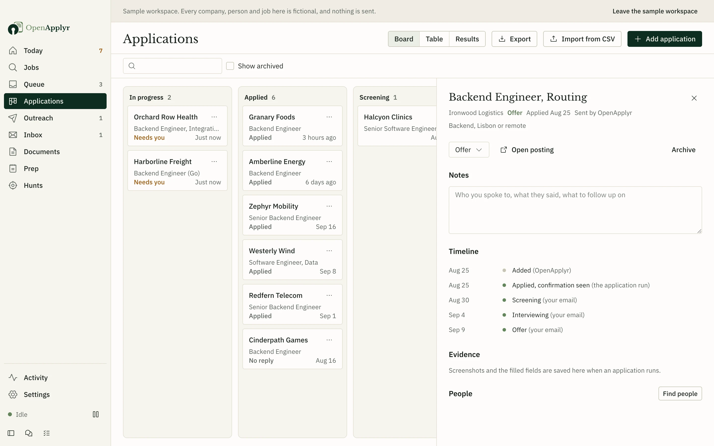
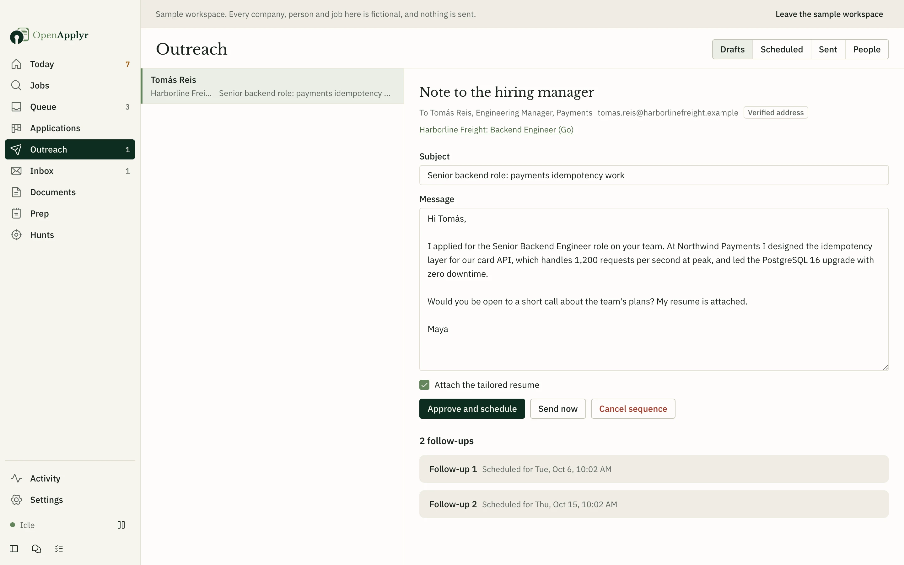
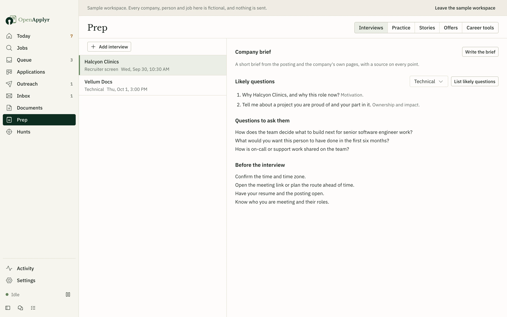

<p align="center">
  <picture>
    <source media="(prefers-color-scheme: dark)" srcset="docs/media/logo-dark.svg">
    
  </picture>
</p>

<p align="center">
  <strong>A job search assistant that runs on your own computer.</strong><br>
  OpenApplyr finds jobs that fit you, prepares a tailored résumé and application for each one, applies once you approve, and keeps track of every reply.
</p>

<p align="center">
  <a href="https://shivashis-adhikari.github.io/openapplyr/">Website</a> ·
  <a href="https://shivashis-adhikari.github.io/openapplyr/#demo">Watch the demo</a> ·
  <a href="#getting-started">Getting started</a> ·
  <a href="#questions">Questions</a>
</p>

<p align="center">
  <a href="https://github.com/shivashis-adhikari/openapplyr/actions/workflows/ci.yml"></a>
  <a href="LICENSE"></a>
  
</p>

<p align="center">
  <a href="https://shivashis-adhikari.github.io/openapplyr/#demo"></a>
  <br>
  <sub><a href="https://shivashis-adhikari.github.io/openapplyr/#demo">Watch the full 24-second demo with sound</a></sub>
</p>

## Why OpenApplyr

Applying for jobs means rewriting the same résumé, answering the same questions on every form, and keeping track of replies spread across dozens of sites. OpenApplyr does that work for you, and shows you everything before it goes out.

- **You stay in charge.** Nothing is sent until you approve it. You see the résumé, the cover letter and every answer on the form first.
- **It never makes things up.** Every line of a tailored résumé has to come from your real experience. Anything that doesn't is stopped before it reaches an employer.
- **Your data stays with you.** It runs on your computer. There is no account, no subscription and no tracking.
- **Use the AI model you prefer.** Add a key from Anthropic, OpenAI, Google or more than a dozen other providers, or run a model on your own computer at no cost.

## What it does

<table>
  <tr>
    <td width="50%"></td>
    <td width="50%"></td>
  </tr>
  <tr>
    <td><strong>Finds jobs that fit.</strong> Checks thousands of company career pages and job boards, merges duplicates, flags likely scams, and explains why each job does or doesn't match you.</td>
    <td><strong>Prepares each application.</strong> Writes a résumé and cover letter for the job and fills in the form's questions. You review everything before approving.</td>
  </tr>
  <tr>
    <td></td>
    <td></td>
  </tr>
  <tr>
    <td><strong>Applies for you.</strong> Fills in the form in your own browser at a normal pace. The first few applications stop just before sending, so you can see exactly what it does.</td>
    <td><strong>Tracks every reply.</strong> Reads your job-related email and updates each application: screening, interview, offer or rejection.</td>
  </tr>
  <tr>
    <td></td>
    <td></td>
  </tr>
  <tr>
    <td><strong>Follows up.</strong> Finds the recruiter or hiring manager and drafts a short, personal note, sent from your own email address once you approve it.</td>
    <td><strong>Helps you prepare.</strong> Likely interview questions, questions to ask, practice interviews and a side-by-side comparison of offers.</td>
  </tr>
</table>

It works with company career sites on Greenhouse, Lever, Ashby, Workday, SmartRecruiters, Workable and Recruitee, and can fill in many other application forms too. You can also paste a link or the text of any job you find elsewhere.

## Getting started

Download OpenApplyr for your system:

| System | Download |
|---|---|
| macOS, Apple silicon | [OpenApplyr-mac-arm64.dmg](https://github.com/shivashis-adhikari/openapplyr/releases/latest/download/OpenApplyr-mac-arm64.dmg) |
| macOS, Intel | [OpenApplyr-mac-x64.dmg](https://github.com/shivashis-adhikari/openapplyr/releases/latest/download/OpenApplyr-mac-x64.dmg) |
| Windows | [OpenApplyr-windows-setup.exe](https://github.com/shivashis-adhikari/openapplyr/releases/latest/download/OpenApplyr-windows-setup.exe) |
| Linux | [AppImage](https://github.com/shivashis-adhikari/openapplyr/releases/latest/download/OpenApplyr-linux-x86_64.AppImage) or [.deb](https://github.com/shivashis-adhikari/openapplyr/releases/latest/download/OpenApplyr-linux-amd64.deb) |

You also need Google Chrome or Microsoft Edge, which OpenApplyr uses to fill in application forms.

The installers are not code-signed yet, so your system asks you to confirm the first time you open the app. On macOS, open **System Settings → Privacy & Security** and choose **Open Anyway**. On Windows, choose **More info → Run anyway**.

<details>
<summary>Run from source instead</summary>

You need [Node.js](https://nodejs.org) 22.13 or later.

```bash
git clone https://github.com/shivashis-adhikari/openapplyr.git
cd openapplyr
npm ci
npm run dev
```

</details>

**Try it first.** On the first screen, choose **Explore a sample workspace first**. It opens a fictional job search with made-up companies and a stand-in AI model, so you can click through everything before adding your own details. Nothing in it is ever sent.

**Set it up for real** in about ten minutes:

1. Add an AI model: paste an API key, or point it at a model running on your computer.
2. Import your résumé (PDF, Word, LinkedIn export or plain text) and check what it read.
3. Fill in the details forms ask for, such as work authorization and notice period.
4. Tell it which jobs to look for, where, and how much to do on its own.
5. Optionally connect your email so it can track replies and send follow-ups. See [connecting email](docs/email-setup.md).

## Privacy

Your profile, documents and applications are stored in a folder on your computer. OpenApplyr has no server and collects no data about you. The only things that leave your computer are:

- the text each task needs, sent to the AI provider you chose (job matching leaves out your name and contact details);
- requests for public job listings;
- the applications and emails you approved, sent from your own browser and email account.

API keys and passwords are encrypted and protected by your system's keychain. You can export or delete everything at any time from Settings.

## Questions

**Is it free?**
Yes. OpenApplyr is free and open source. You only pay your AI provider for what you use, or nothing if you run a model on your own computer. Settings shows the cost of every task and stops at the daily and monthly budget you set.

**Will it apply without asking me?**
Not unless you turn that on. By default, every application waits for your approval. If you allow it to apply on its own for a particular search, it still only does so when every check passes, and the rest wait for you.

**How many applications will it send?**
As many as you approve. By default it sends at most 15 a day per search and 40 in total, never more than two to the same company in a month, and spaces them out during the hours you choose.

**What happens when a form asks something it doesn't know?**
The application pauses and the question appears on your Today screen. Answer it once and it's saved for next time.

**Does it work with LinkedIn or Indeed?**
Not yet. You can paste a LinkedIn or Indeed job to score it, prepare your documents and track it, but applying through those sites isn't supported yet.

**Will employers know software filled in the form?**
OpenApplyr fills in the same form you would, in a normal browser, with documents built from your real experience. It does not solve CAPTCHAs or try to hide that it is software; when a site asks for a check, you complete it yourself. Some sites don't allow automated applications, so check the terms of the sites you use.

## Contributing

Bug reports, fixes and new job sites are all welcome. Start with [CONTRIBUTING.md](CONTRIBUTING.md). To report a security issue privately, see [SECURITY.md](SECURITY.md).

## License

OpenApplyr is released under the [GNU AGPL-3.0](LICENSE). City data comes from [GeoNames](https://www.geonames.org) (CC BY 4.0). Fonts are used under the SIL Open Font License; their licenses are in `assets/fonts`.
